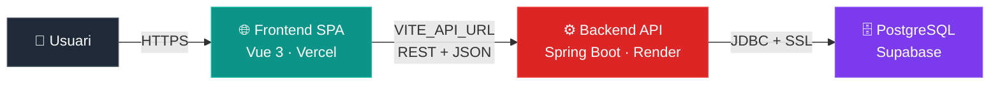

# 🌐 Clients Frontend — SPA (Vue 3)

SPA de gestió de clients que consumeix l'API de Spring Boot.

- **URL pública:** https://clients-frontend-one.vercel.app
- **Backend connectat:** https://clients-api-ufmt.onrender.com

## 📐 Arquitectura



## 🛠️ Stack
- **Vue 3** (Composition API + `<script setup>`)
- **Pinia** (gestió d'estat global)
- **Vue Router** (rutes dinàmiques `/clients/:id`)
- **Axios** (peticions HTTP amb interceptors)
- **Vite** (build tool)

## 🚀 Desplegament

### Variables d'entorn a configurar a Vercel

| Variable | Valor |
|---|---|
| `VITE_API_URL` | `https://clients-api-ufmt.onrender.com/api` |

> Configurar la variable a **Settings → Environment Variables** del projecte Vercel. Aplica a Production, Preview i Development. Després de canviar-la cal **redesplegar** (no només rebuild).

### SPA Routing
El `vercel.json` configura el rewrites perquè Vercel reenviï totes les rutes a `index.html`, i així Vue Router pot gestionar la navegació client-side sense errors 404 en refrescar.

## 💻 Execució local

1. `npm install`
2. Copiar `.env.example` a `.env`
3. `npm run dev`
4. Obrir `http://localhost:5173`

## 🐛 Errors trobats durant el desplegament

### Error 1 — Pàgina blanca a Vercel després d'un push

**Causa:** El primer build de Vercel no tenia la env var `VITE_API_URL` configurada, així que `import.meta.env.VITE_API_URL` era `undefined` i totes les peticions anaven a `undefined/clients`.

**Solució:** Afegir `VITE_API_URL` a **Settings → Environment Variables** apuntant a la URL de Render, i **fer un redeploy** (Settings → Deployments → ··· → Redeploy).

---

### Error 2 — `CORS policy: No 'Access-Control-Allow-Origin' header`

**Causa:** El backend de Render encara tenia la URL `http://localhost:5173` com a allowed origin (de la fase de desenvolupament).

**Solució:** Actualitzar la variable d'entorn `APP_CORS_ALLOWED_ORIGINS` a Render amb la URL exacta de Vercel (sense `/` final).

---

### Error 3 — Primera petició triga 30-60s

**Causa:** Render Free atura el contenidor després de 15 min d'inactivitat. La primera petició desperta el JVM (cold start).

**Solució aplicada:** Augmentar el timeout d'Axios a 15 segons (a `src/services/api.js`) per cobrir el cold start sense que doni timeout error.

---

### Error 4 — Errors d'API contaminant Pinia

**Causa:** Spring retorna `{ timestamp, status, error, message, path }` en errors 5xx. El store assignava `response.data` directament a `clients`, omplint la llista amb objectes d'error.

**Solució:** Interceptor d'Axios que transforma errors en una forma neta, i validació al store que només accepta arrays vàlids:
```js
clients.value = Array.isArray(data) ? data : []
```